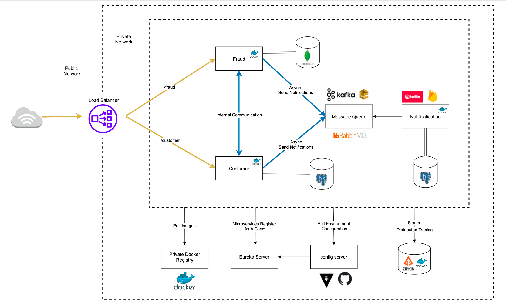

# Postgres Databases
1. customer
2. fraud
3. notification

# Test
POST Request to localhost:8080/api/v1/customers

BODY:
```
{
    "firstName": "Robert",
    "lastName": "Jones",
    "email": "testemail@gmaill.com"
}
``` 